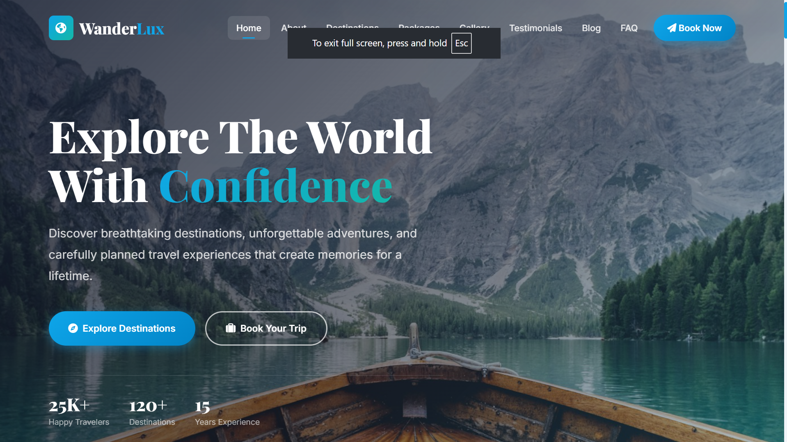
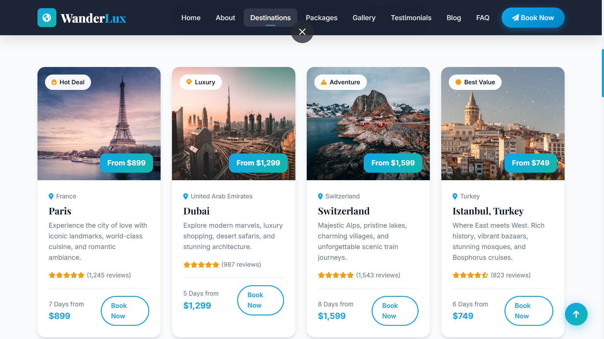
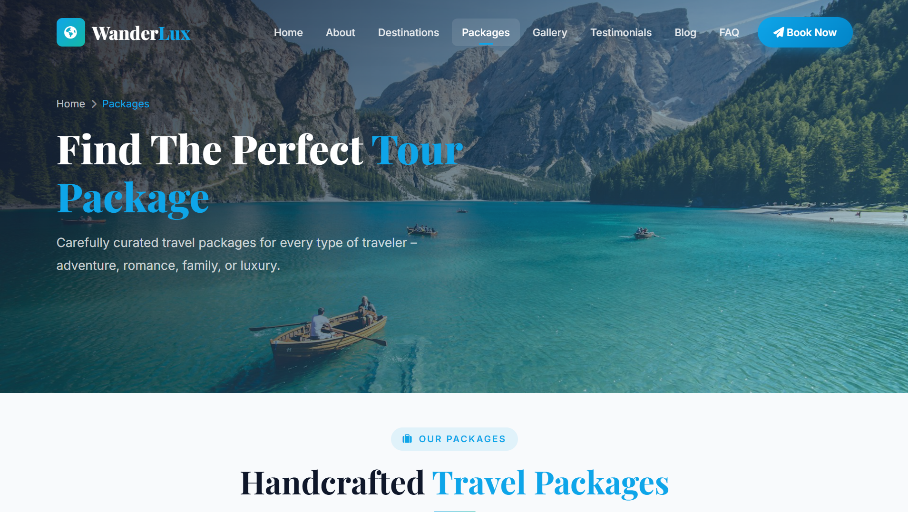
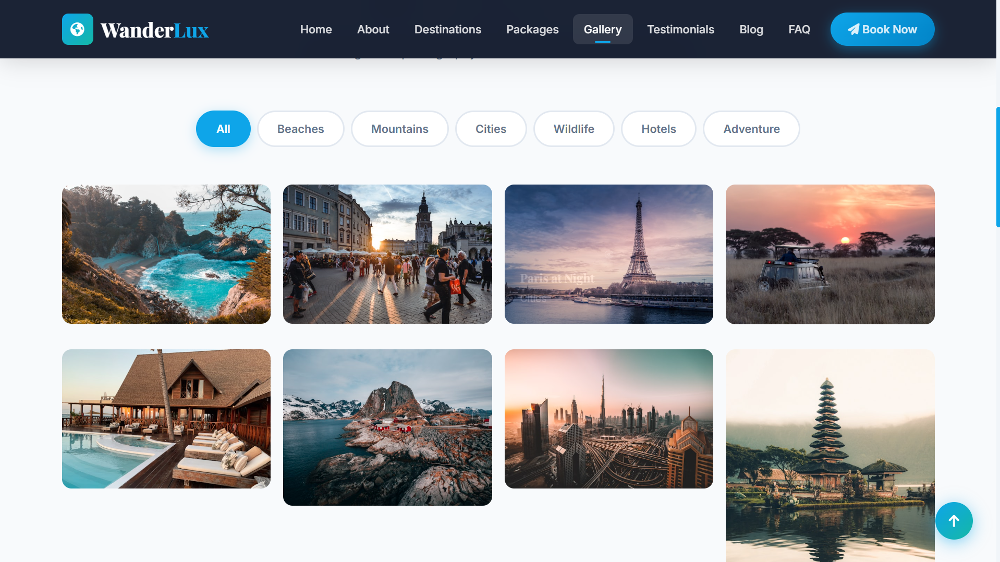
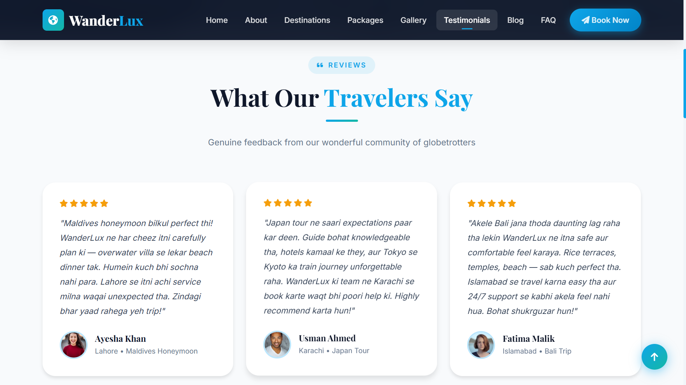
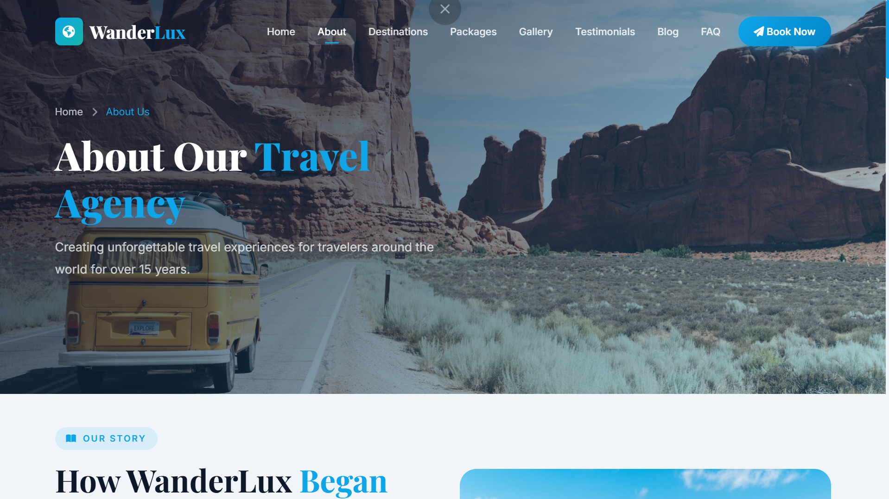
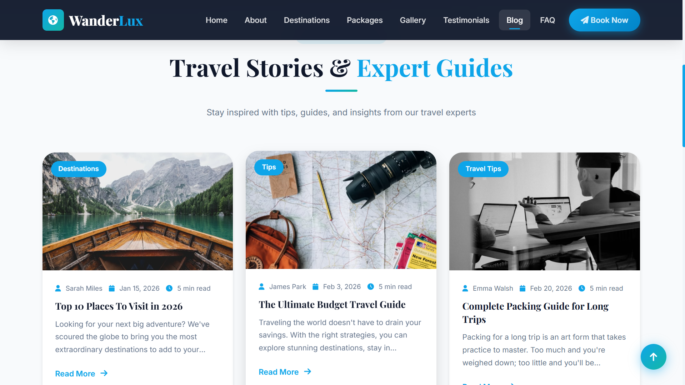
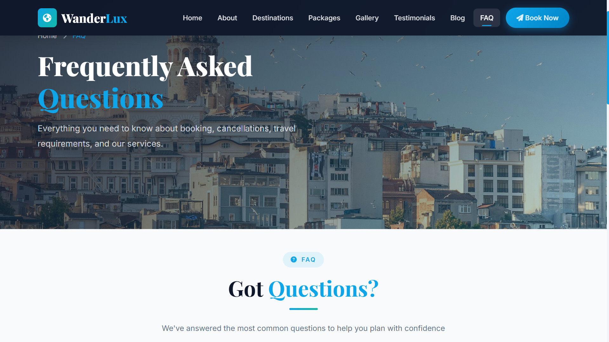
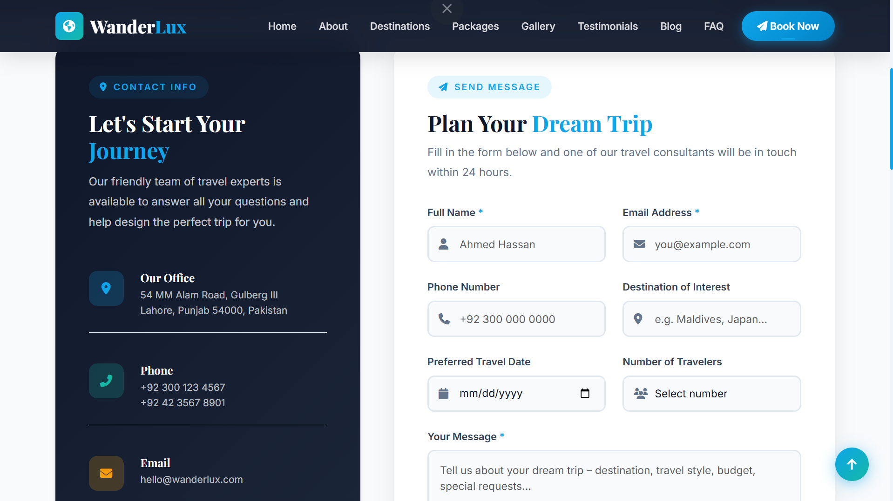

# ✈️ WanderLux – Travel Agency Website

A modern, fully responsive **multi-page Travel Agency Website** built with HTML5, CSS3, Bootstrap 5, and Vanilla JavaScript. Designed to look and feel like a real production-level travel company website.

---

## 🌐 Live Preview

> Open `index.html` in your browser to view the website locally.

---

## 📸 Screenshots

### 🏠 Home Page – Hero Section


### 🗺️ Destinations Page


### 📦 Tour Packages


### 🖼️ Gallery Page


### 💬 Testimonials Page


### 📖 About Page


### 📝 Blog Page


### ❓ FAQ Page


### 📞 Contact Page


---

## 🛠️ Technologies Used

| Technology | Version | Purpose |
|---|---|---|
| HTML5 | Latest | Page structure & semantic markup |
| CSS3 | Latest | Styling, animations, hover effects |
| Bootstrap 5 | 5.3.2 | Responsive grid, components, navbar |
| Font Awesome | 6.5.0 | Icons throughout the website |
| Google Fonts | — | Playfair Display + Inter typography |
| Vanilla JavaScript | ES6+ | Interactivity & dynamic features |

---

## 📁 Project Structure

```
travel-agency/
│
├── index.html              # Home Page
├── about.html              # About Us Page
├── destinations.html       # Destinations Page
├── packages.html           # Tour Packages Page
├── gallery.html            # Gallery Page
├── testimonials.html       # Testimonials Page
├── blog.html               # Blog Page
├── faq.html                # FAQ Page
├── contact.html            # Contact Page
│
├── css/
│   └── style.css           # Main stylesheet (all custom CSS)
│
├── js/
│   └── main.js             # Main JavaScript file
│
├── images/
│   ├── hero-main.jpg
│   ├── dest-paris.jpg
│   ├── dest-dubai.jpg
│   └── ... (53 images total)
│
└── README.md
```

---

## 📄 Pages Overview

| Page | Description |
|---|---|
| **Home** | Hero section, destinations, packages, stats, testimonials, newsletter |
| **About** | Company story, mission & vision, team members, core values |
| **Destinations** | 12 destination cards, featured banner, travel tips |
| **Packages** | 8 tour packages with filter tabs, special offer banner |
| **Gallery** | 20+ images with category filter and lightbox |
| **Testimonials** | 12 Pakistani customer reviews with stats |
| **Blog** | 8 travel articles with newsletter signup |
| **FAQ** | 15 accordion questions & answers |
| **Contact** | Contact form, office info (Lahore), Google Maps |

---

## ✨ Key Features

- ✅ Fully responsive — Mobile, Tablet, Laptop, Desktop
- ✅ Sticky navbar with scroll effect
- ✅ Smooth hover animations on all cards
- ✅ Animated number counters (25K+ travelers, 120+ destinations)
- ✅ Gallery with category filter tabs & lightbox
- ✅ Package filter by category (Adventure, Family, Honeymoon, etc.)
- ✅ Bootstrap 5 accordion for FAQ
- ✅ Form submission with loading animation
- ✅ Back-to-top button
- ✅ Pakistani localization (Lahore office, Pakistani testimonials)
- ✅ All images saved locally (works without internet)
- ✅ SEO-friendly HTML structure with meta tags
- ✅ Accessible with ARIA labels

---

## 🎨 Design System

| Element | Value |
|---|---|
| Primary Color | `#0EA5E9` (Sky Blue) |
| Secondary Color | `#14B8A6` (Teal) |
| Accent Color | `#F59E0B` (Amber) |
| Dark Color | `#0F172A` (Navy) |
| Background | `#F8FAFC` (Light Gray) |
| Heading Font | Playfair Display |
| Body Font | Inter |

---

## 🚀 How to Run

1. Clone or download this repository
2. Open the `travel-agency/` folder
3. Double-click `index.html` to open in browser
4. No server or installation required — pure HTML/CSS/JS

```bash
git clone https://github.com/Somanashraf/ezitech-tasks.git
cd ezitech-tasks/travel-agency
# Open index.html in your browser
```

---

## 📍 Office Location

> **WanderLux Travel Agency**
> 54 MM Alam Road, Gulberg III
> Lahore, Punjab 54000, Pakistan
> 📞 +92 300 123 4567
> 📧 hello@wanderlux.com

---

## 👨‍💻 Developer

**Developed by:** Soman Ashraf
**Project:** Travel Agency Website — EziTech Institute Task
**Date:** July 2026

---

## 📜 License

This project is created for educational purposes as part of EziTech Institute coursework.

---

*Made with ❤️ using HTML5, CSS3 & Bootstrap 5*
